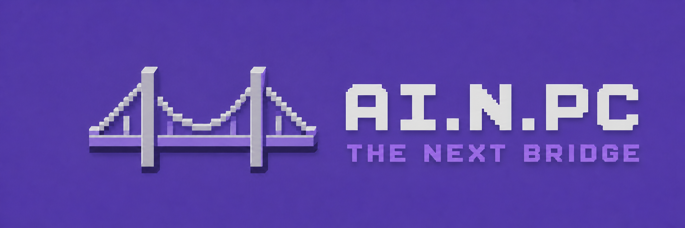

# AI.N.PC — The Next Bridge

AI.N.PC is a local prototype that lets you type freely to game characters and get an AI-generated reply. Stardew Valley is the first game we connected, but the AI service is separate so another game—or another computer—can use it later.

AI.N.PC is an unofficial fan-made prototype and is not affiliated with or endorsed by ConcernedApe. Stardew Valley and its related names and assets belong to their respective owners. No game files are included in this repository.

```text
Stardew Valley -> SMAPI mod -> NPCBridge -> Ollama
```

Right now the project is text-only. Walk close to a supported character, press `Alt+0`, type something, and the answer appears in a normal Stardew dialogue box.

The current demo, including examples and honest limitations, is recorded in [Working Prototype Snapshot](docs/WORKING_PROTOTYPE.md).

## What works today

- Free-text conversations inside Stardew Valley
- Abigail and Linus, each with their own character profile
- Local AI through Ollama and `qwen3:4b-instruct-2507-q4_K_M`
- Recent conversation memory and persistent relationship scores
- Positive, neutral, and negative conversation outcomes
- NPC reactions that can stay guarded after repeated insults
- Facial-expression descriptions in the dialogue box
- Stardew friendship changes based on conversation results
- A cancellable waiting screen while the model is working
- Protection against old, cancelled, or duplicate replies changing saved state
- Source mode and a packaged `NPCBridge.exe`
- Protocol v2, with v1 kept for compatibility

## What you need

You will need:

- Windows
- Stardew Valley
- SMAPI
- The .NET SDK
- Python
- Ollama
- `qwen3:4b-instruct-2507-q4_K_M`

## Running the demo

Tell the scripts where Stardew Valley is installed for the current PowerShell session:

```powershell
$env:STARDEW_GAME_PATH = "<your Stardew Valley folder>"
```

Start Ollama and NPCBridge:

```powershell
.\scripts\start-system.ps1
```

Launch the game through `StardewModdingAPI.exe` inside your Stardew Valley folder. Load a save, stand within four tiles of Abigail or Linus, and press `Alt+0` on the top number row.

Enter sends the message. Escape closes the text box or cancels a reply that is still being generated.

## Development

Set up Python dependencies:

```powershell
.\scripts\setup-dev.ps1
```

Run the bridge from source:

```powershell
.\scripts\start-bridge.ps1
```

Run the automated tests:

```powershell
.\.venv\Scripts\python.exe -m pytest -q tests\test_bridge.py
```

Run live character checks against the configured model:

```powershell
.\scripts\persona-regression.ps1
```

Local reports are written to the ignored `reports` folder.

## Building and installing

Build the Stardew mod after setting `STARDEW_GAME_PATH`:

```powershell
.\scripts\build-mod.ps1
```

Install it using the environment variable:

```powershell
.\scripts\install-mod.ps1
```

You can also pass the location for a single install:

```powershell
.\scripts\install-mod.ps1 -GamePath "<your Stardew Valley folder>"
```

Build the Windows bridge package:

```powershell
.\scripts\build-bridge-exe.ps1
```

The packaged bridge is written to `artifacts\NPCBridge`. Keep its executable, configuration, and character profiles together if you move it.

## Configuration

NPCBridge defaults are in `config/default.json`. These environment variables can override them:

- `NPCBRIDGE_HOST`
- `NPCBRIDGE_PORT`
- `NPCBRIDGE_OLLAMA_ENDPOINT`
- `NPCBRIDGE_MODEL`
- `NPCBRIDGE_CONFIG`
- `NPCBRIDGE_PROFILES`
- `NPCBRIDGE_MEMORY`

The Stardew mod creates its own `config.json` inside its installed mod folder. It controls the hotkey, bridge address, timeout, and interaction distance.

NPCBridge listens only on `127.0.0.1` by default.

## Project folders

- `stardew-mod/StardewAI` — the SMAPI mod
- `npc-bridge` — the local dialogue service
- `npc-profiles` — character personalities and speaking rules
- `protocol` — the JSON contract between games and the bridge
- `config` — default bridge settings
- `tests` — automated bridge tests
- `scripts` — setup, build, install, and test helpers
- `docs` — snapshots, release notes, and artwork

Game files, model files, build output, local databases, and machine-specific settings are not stored in Git.

## Known limits

- Only Abigail and Linus are supported
- Conversation is text-only
- CPU generation can still be slow, especially on the first reply
- Relationship judgment currently has only positive, neutral, and negative results
- Reconciliation after a very negative relationship still needs work
- Facial expressions are text, not portrait or animation changes
- There is no voice, generated quests, autonomous movement, or multiplayer support
- The localhost API does not use authentication

The working demo is v0.4.2. Earlier changes are listed under `docs/releases`.

## Quick troubleshooting

- If `Alt+0` does nothing, make sure the game was launched through SMAPI.
- If the bridge is unavailable, run `scripts\start-system.ps1`, then `scripts\test-bridge.ps1`.
- If the mod cannot build or install, check that `STARDEW_GAME_PATH` points to the folder containing the game executable.
- If a character is rejected, remember that only Abigail and Linus have profiles right now.
- The first reply is slower because Ollama may need to load the model into memory.
